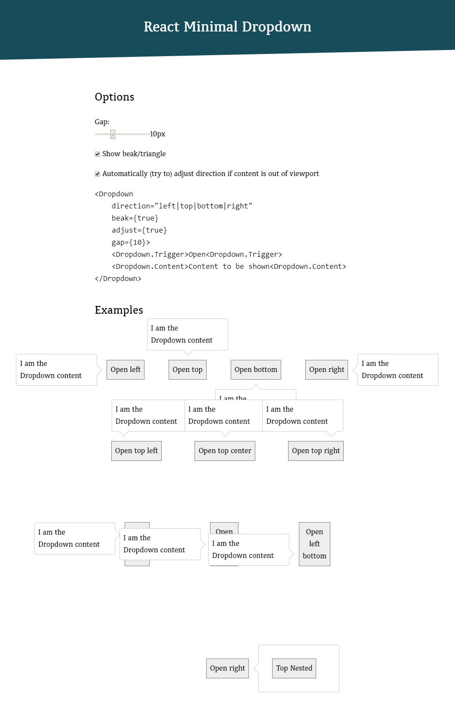

# ⚛ React Minimal Dropdown

Pretty straightforward: I needed a tiny **dropdown** component which was good for exactly one thing: a user clicks on a trigger and content appears next to it. That's it. No built-in `<select>` imitation or whatever. Just a plain dropdown. I looked at dozens of existing React dropdown components but all of them were either overcomplicated (for my needs) or unmaintained or had a really bad code quality (or all of it). The result: **React Minimal Dropdown**.

You can configure a direction, you have a very little and neutral default styling and that's it. Use it if you need the simplest possible Dropdown with zero dependencies, adjust and style it to your needs and be happy :)

## Project philosophy

We take the stability and performance of this package seriously, because one day it might run millions of times a day in browsers all around the world. Updates are thoroughly reviewed for performance impacts before being released.

I don't aim to cover any exotic use case but instead I focus on a minimum of features a dropdown should have. Thus the name react-minimal-dropdown. The react-minimal-dropdown package follows the SemVer standard for versioning.

(Inspired by [classnames](https://github.com/JedWatson/classnames#project-philosophy))

## Installation

```
npm install react-minimal-dropdown
```
or:
```
yarn add react-minimal-dropdown
```

## Usage

There are 3 components you must use to get `Dropdown` functionality:

*   `<Dropdown>` – as mandatory wrapper
*   `<Trigger>` – acts as trigger to show and hide content
*   `<Content>` – the content to be shown

`Trigger` and `Content` are defined as static members of the `Dropdown` component so you only have to import `Dropdown` and can then use it as `<Dropdown.Trigger>` and `<Dropdown.Content>` in your JSX instead of having to import all of them explicitly (which is also possible though).

React Minimal Dropdown is built using Webpack with `umd` as `libraryTarget` so it should work fine in all environments.

### Example

You can find a live example here:
https://manuelbieh.github.io/react-minimal-dropdown/example/

```js
import React from 'react';
import Dropdown from 'react-minimal-dropdown';

// or import and use the components directly:
// import { Dropdown, Trigger, Content } from 'react-minimal dropdown'

export const Example = () => {
  return (
    <Dropdown direction="right" beak>
      <Dropdown.Trigger>Click me!</Dropdown.Trigger>
      <Dropdown.Content>You clicked the dropdown trigger!</Dropdown.Content>
    </Dropdown>
  );
};
```

**Attention:** Don't forget to also include the css file from `react-minimal-dropdown/dist/css/index.css`!

### Styling

Internally RMD uses CSS Modules for scoped styling so you should not be worried that including RMD might break your CSS. If you want to overwrite the existing default styling you can use the predefined BEM like CSS classes:

*   `ReactMinimalDropdown`
*   `ReactMinimalDropdown__Content`
*   `ReactMinimalDropdown__Trigger`.

Also there are modifier classes both for the direction …

*   `ReactMinimalDropdown--top`
*   `ReactMinimalDropdown--right`
*   `ReactMinimalDropdown--bottom`
*   `ReactMinimalDropdown--left`

and the open state:

*   `ReactMinimalDropdown--isOpen`
*   `ReactMinimalDropdown--isClosed`

### Options

| Prop         | Default  | Description                                                                                                                                                                            |
| ------------ | -------- | -------------------------------------------------------------------------------------------------------------------------------------------------------------------------------------- |
| `adjust`       | `true`   | Adjust content position if it is out of viewport. The component will try to open it the opposite direction then.                                                                                 |
| `beak`         | `false`  | Show a beak/triangle                                                                                                                                                                   |
| `direction`    | `bottom` | Where to open the dropdown (Possible values: `top`, `right`, `bottom`, `left`)                                                                                                         |
| `edge`         | center   | Where to align the content. (Can be `left`, `center`, `right` when `direction` is set to `top` or `bottom` and `bottom`, `center`, `top` when `direction` is set to `left` or `right`) |
| `gap`          | `0`      | gap/margin between the content and the trigger                                                                                                                                         |
| `ignoreScroll` | `true`   | Don't recalculate the content position on `window.scroll`                                                                                                                              |
| `ignoreResize` | `false`  | Don't recalculate the content position on `window.resize`                                                                                                                              |
| `show`         | `false`  | flag to have the dropdown content opened initially. This is only respected when the component gets mounted first!                                                                      |

### Events

You can trigger callbacks on certain events. Just use the following props on the `<Dropdown>` element:

| Event         | Description                                            |
| ------------- | ------------------------------------------------------ |
| onBeforeOpen  | Fires **before** `this.state.show` gets set to `true`  |
| onBeforeClose | Fires **before** `this.state.show` gets set to `false` |
| onAfterOpen   | Fires **after** `this.state.show` gets set to `true`   |
| onAfterClose  | Fires **after** `this.state.show` gets set to `false`  |

### API

There are some methods you can use on the `<Dropdown>` element to control it from outside.

| Method                        | Description                                                    |
| ----------------------------- | -------------------------------------------------------------- |
| `.show()` (alias: `.open()`)  | Open the dropdown                                              |
| `.hide()` (alias: `.close()`) | Close the dropdown                                             |
| `.toggle()`                   | Toggle the dropdown state                                      |
| `.isOpen()`                   | (Boolean) Check if the dropdown state is currently open or not |
| `.recalculatePosition()`      | Recalculate the position of the `<Dropdown.Content>`           |

## Todo

*   Add some tests
*   Add typings for TypeScript
*   …

## Changelog
*   [1.3.1]: No longer automatically generating an `aria-labelledby` attribute as this was causing issues with server side rendering
*   [1.2.0]: Added prettier and using ES2015+ class property syntax for components.
*   [1.1.0]: Possibly breaking: `<Dropdown>` default style was changed to `display: inline-block` (was `block` before). `block={true}` prop was added to switch to block.
*   [1.0.0]: Initial release

## License

[MIT](LICENSE). Copyright (c) 2017 Manuel Bieh.

## Screenshot


